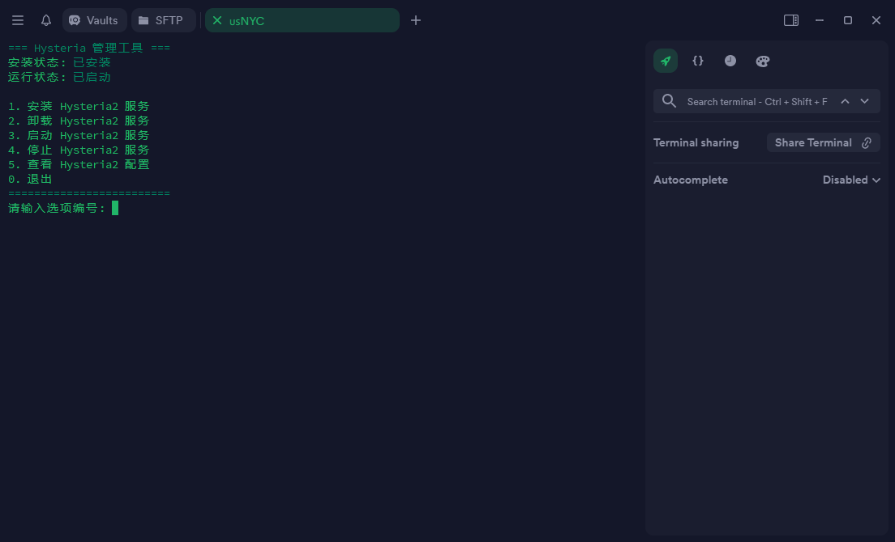

## 终端预览




## 一键脚本
```
bash <(curl -fsSL hysteria-inky.vercel.app)
```

## 详细说明
- 使用官方版内核搭建 Hysteria2

- 使用自签证书，无需绑定域名，方便快捷

- 安装完成后自动输出客户端Surge&yaml配置

## 端口跳跃
```
apt install iptables-persistent
iptables -t nat -A PREROUTING -p udp --dport 50000:55000  -j DNAT --to-destination :PORT
ip6tables -t nat -A PREROUTING -p udp --dport 50000:55000  -j DNAT --to-destination :PORT
netfilter-persistent save
```

确认规则是否生效
```
iptables -t nat -L -v -n
ip6tables -t nat -L -v -n
```
筛选 UDP 数据包
```
tcpdump -nn udp 'portrange 50000-55000'
```
查看自签证书指纹
```
openssl x509 -in /etc/hysteria/server.crt -noout -fingerprint -sha256
```
## 项目地址：https://github.com/apernet/hysteria
