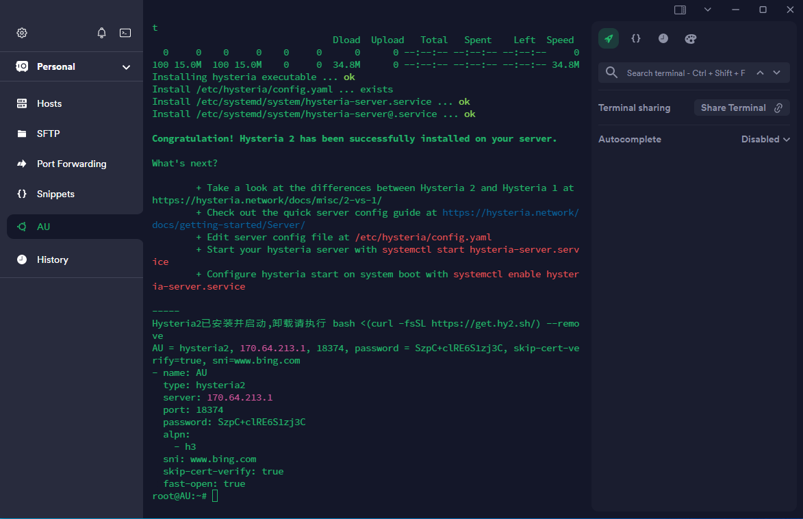

## 预览



# Hysteria2 自动化安装脚本

该脚本用于在 Linux 系统上自动化安装和配置 Hysteria2 代理服务。

## 一键脚本

```bash
curl -sS -o Hysteria.sh https://raw.githubusercontent.com/passeway/Hysteria/main/Hysteria.sh  && chmod +x Hysteria.sh && ./Hysteria.sh
```

- 安装完成后自动输出客户端Surge&yaml配置。

